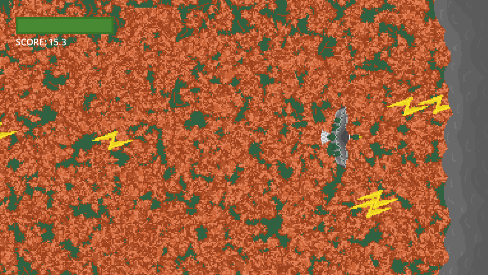
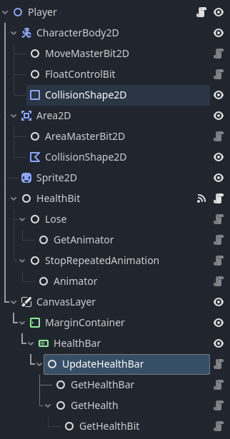

# Siege Week 4 -> Migration
A pretty simple arcade game about migrating birds made for Hackclub's Siege Week 4; the theme this week was Fall

 A picture of the gameplay; dodging lighting bolts coming out of a thundercloud for as long as possible to stay alive.

## Controls
- WASD to move
- Play on web [here](https://baton-0.itch.io/migration).

## Notable Code Features
- Made using a composition framework; all the functionality is split into smaller pieces. ([Decent explanation by Bitlytic](https://youtu.be/74y6zWZfQKk)) 
- 
- Completely overhauled the framework from the last weeks.
- Added script templates to make building the framework easier.

## Credits
- All the art and code is mine, no credits this week.